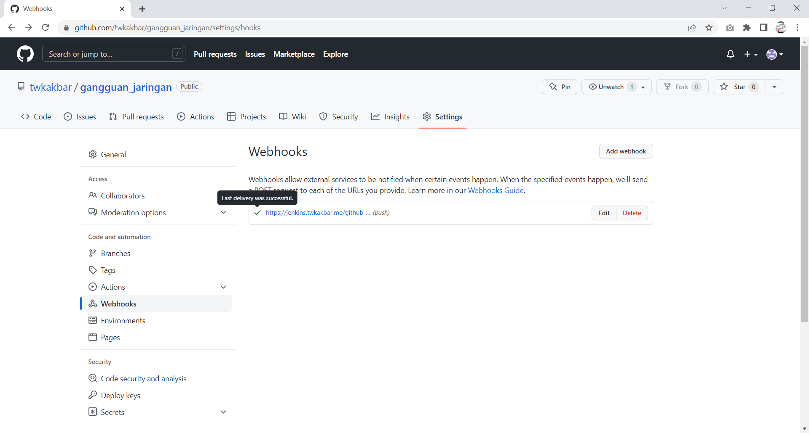

# CI CD With Jenkins

## Langkah 1 - Instalasi and Config Jenkins

1. Install Jenkins menggunakan perintah berikut:

Pertama kita install openjdk karena jenkins dibuat menggunakan java

```
sudo apt install openjdk-11-jdk
```


```
wget -q -O - https://pkg.jenkins.io/debian-stable/jenkins.io.key | sudo apt-key add -
```

```
sudo sh -c 'echo deb https://pkg.jenkins.io/debian-stable binary/ > \
/etc/apt/sources.list.d/jenkins.list'
```

```
sudo apt update
```


Install jenkins menggunakan perintah berikut:

```
sudo apt install jenkins
```


2. Cek status jenkins menggunakan 

```
sudo systemctl status jenkins
```


3. Sekarang masuk ke jenkins menggunakan web browser dan jenkins menggunakan port 8080


4. Masukkan administrative password dengan cat seperti berikut:

```
sudo cat /var/lib/jenkins/secret/initialAdminPassword
```


5. Lalu masukkan secret nya dan klik Install suggested plugins


6. Berikut tampilan awal dari jenkins


7. Sekarang kita masuk ke plugin manaager dan install SSH Agent


8. Lalu kita cek apakah SSH agent sudah berhasil di install


9. Sekarang masuk ke server aplikasi dan config git kita


10. Kemudian copy id_rsa pub ke github kita


11. Cek koneksi ke github


12. Sekarang kita copy private key untuk dimasukkan ke jenkins kita


13. Masuk ke credential dan tambahkan credential kita dengan private key tadi


14. Sekarang kita akan menambahkan pipeline ke wayshub-frontend kita


15. Centang Github hook disini


16. Sekarang kita akan membuat file jenkinsfile untuk pipeline nya


17. Masukkan pipeline kita, untuk yang saya gunakan seperti berikut:

```
def secret = 'server'
def server = 'twk@103.174.114.240'
def directory = 'wayshub-frontend'
def branch = 'main'

pipeline{
    agent any
    stages{
        stage ('docker delete & git pull'){
            steps{
                sshagent([secret]) {
                    sh """ssh -o StrictHostKeyChecking=no ${server} << EOF
                    cd ${directory}
                    docker-compose down
                    docker system prune -f
                    git pull origin ${branch}
                    exit
                    EOF"""
                }
            }
        }
        stage ('docker build'){
            steps{
                sshagent([secret]) {
                    sh """ssh -o StrictHostKeyChecking=no ${server} << EOF
                    cd ${directory}
                    docker-compose build
                    exit
                    EOF"""
                }
            }
        }
        stage ('docker up'){
            steps{
                sshagent([secret]) {
                    sh """ssh -o StrictHostKeyChecking=no ${server} << EOF
                    cd ${directory}
                    docker-compose up -d
                    exit
                    EOF"""
                }
            }
        }
    }
}
```


18. Sekarang kita push wayshub-frontend nya ke github kita


19. Sekarang kita masukkan repository kita ke jenkins


20. Lalu apply dan savev


21. Sekarang masuk ke server aplikasi dan masuk ke directory .ssh dan masukkan key public ke authorized_keys agar jenkins bisa masuk ke dalam server kita


22. Jika sudah semua maka sekarang kita klik build now


23. Dan bisa dilihat proses build kita telah berhasil


24. Sekarang kita akan menambahkan webhooks agar repository github kita bisa di trigger oleh jenkins


25. Klik add webhooks


26. Masukkan link jenkins kita yang sudah https


27. Berikut hasilnya


