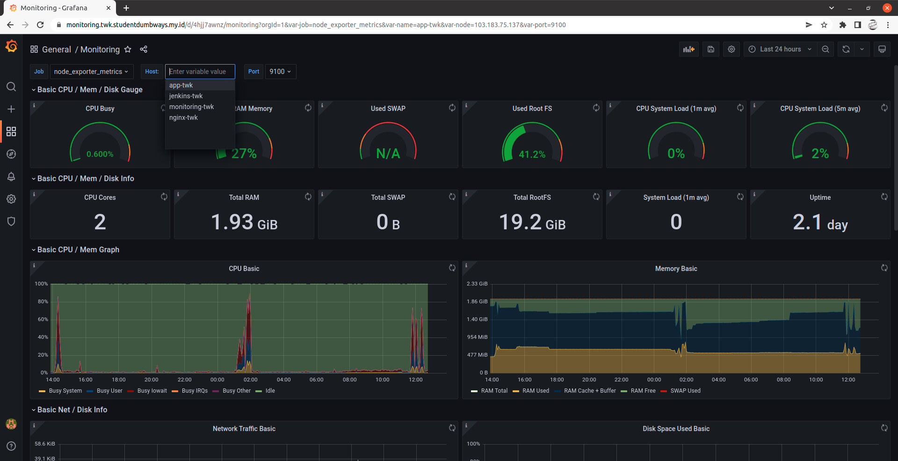

# Setup Ansible and Monitoring

## Langkah 1 - Ansible Installation (Dilakukan di local)

[Untuk Instalasi Ansible ada di sini](https://github.com/twkakbar/proyek_ta/edit/main/monitoring%20(server)/monitoring-server.md)

## Langkah 2 - Ansible Playbook

1. Berikut adalah ansible playbook yang saya gunakan, dikarenakan untuk menginstall node exporter itu harus ada di semua server maka akan lebih mudah menggunakan ansible

```
- hosts: all
  become: true
  tasks:
  - name: Run Node Exporter
    shell: docker run -d --net="host" --pid="host" -v "/:/host:ro,rslave" --name nodeex quay.io/prometheus/node-exporter --path.rootfs=/host

- hosts: monitoring
  become: true
  tasks:
  - name: Make volume folder
    file:
     path: /home/monitoring/prometheus
     state: directory

  - name: Copy services
    copy:
     src: services/prometheus.yml
     dest: /home/monitoring/prometheus

  - name: Login to DockerHub
    docker_login:
     username: twkakbar
     password: 

  - name: Pull Prometheus
    become: true
    docker_image:
     name: bitnami/prometheus
     source: pull

  - name: Container Prometheus
    become: true
    docker_container:
     name: prometheus
     image: bitnami/prometheus
     ports:
      - 9090:9090
     volumes: /home/monitoring/prometheus:/etc/prometheus

  - name: Pull Grafana
    become: true
    docker_image:
     name: grafana/grafana    
     source: pull

  - name: Container Grafana
    become: true
    docker_container:
     name: grafana
     image: grafana/grafana
     ports:
      - 3000:3000
```

2. Cek pada browser untuk melihat apakah prometheus dan grafana sudah berjalan

prometheus:


grafana:


