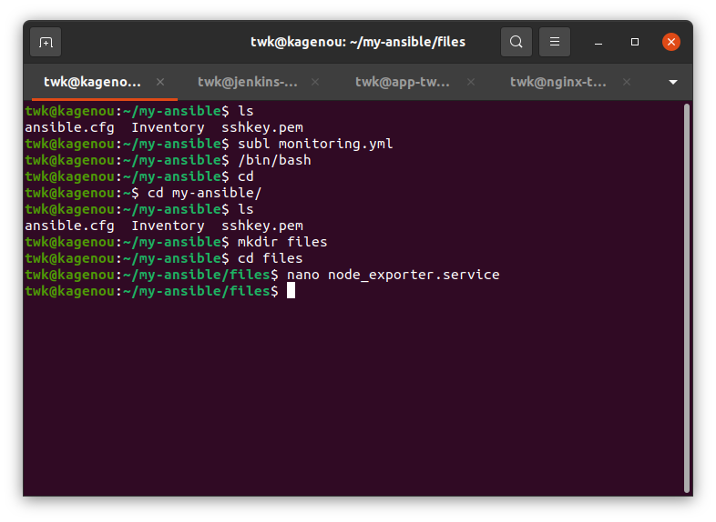

# Setup Ansible dan Monitoring

## Langkah 1 - Ansible Installation (Dilakukan di local)

1. Lakukan update dan upgrade terlebih dahulu

```
sudo apt update; sudo apt upgrade
```


Kemudian lakukan instalasi aplikasi ansible

```
sudo apt install software-properties-common
```

```
sudo add-apt-repository --yes --update ppa:ansible/ansible
```

```
sudo apt install ansible
```

2. Cek apakah ansible sudah terinstall

```
ansible --version
```


## Langkah 1 - Setup Ansible (Dilakukan di local)
1. Buat directory baru dan file baru bernama Inventory yang berisi isi dari server kita nantinya yang akan dilakukan otomisasi


2. Kirim private key ke setiap server agar manage lebih mudah


3. Copy private key server dan paste di file baru yang bernama sshkey.pem di local


4. Buat file baru yang bernama ansible.cfg, file ini berfungsi untuk sebagai penghubung antara server yang ada di inventory ke local kita dengan private key tadi


5. Cek koneksi ke server tujuan dengan menggunakan perintah berikut:

```
ansible all -m ping
```


6. Buat dahulu sebuah folder baru dan didalamnya buat file-file yang berisi services node exporter dan prometheus




Di bagian sini jangan lupa untuk mengganti target ke ip server yang ingin kalian monitor


7. Hasil di dalam folder files seperti berikut


8. Kemudian kembali ke directory sebelumnya dan buat file baru bernama monitoring.yml, ini adalah file ansible playbook 

Untuk ansible playbook yang saya gunakan adalah seperti berikut:

```
- hosts: all
  become: true
  tasks:
    - name: "Update"
      apt:
        update_cache: yes

    - name: "Upgrade"
      apt:
        upgrade: yes

    - name: "Install node exporter"
      shell: "wget https://github.com/prometheus/node_exporter/releases/download/v1.3.1/node_exporter-1.3.1.linux-amd64.tar.gz; tar -xf node_exporter-1.3.1.linux-amd64.tar.gz; sudo mv node_exporter-1.3.1.linux-amd64/node_exporter /usr/local/bin; sudo useradd -rs /bin/false node_exporter"
      args:
        executable: /bin/bash

    - name: "Create service for node exporter"
      copy:
        src: node-exporter.service
        dest: /etc/systemd/system/node-exporter.service

    - name: "Reload service for node exporter"
      shell: "sudo systemctl daemon-reload; sudo systemctl enable node-exporter; sudo systemctl start node-exporter"
      args:
        executable: /bin/bash

- hosts: prometheus
  become: true
  tasks:
    - name: "Install prometheus"
      shell: "wget https://github.com/prometheus/prometheus/releases/download/v2.36.0/prometheus-2.36.0.linux-amd64.tar.gz; sudo mv prometheus-2.36.0.linux-amd64/prometheus prometheus-2.36.0.linux-amd64/promtool /usr/local/bin; sudo mkdir /etc/prometheus /var/lib/prometheus; sudo mv prometheus-2.36.0.linux-amd64/consoles prometheus-2.36.0.linux-amd64/console_libraries /etc/prometheus"
      args:
        executable: /bin/bash

    - name: "Add node exporter to prometheus"
      copy:
        src: prometheus.yml
        dest: /etc/prometheus/prometheus.yml

    - name: "Add user prometheus"
      shell: "sudo useradd -rs /bin/false prometheus; sudo chown -R prometheus: /etc/prometheus /var/lib/prometheus"
      args:
        executable: /bin/bash

    - name: "Create service for prometheus"
      copy:
        src: prometheus.service
        dest: /etc/systemd/system/prometheus.service

    - name: "Reload service for prometheus"
      shell: "sudo systemctl daemon-reload; sudo systemctl enable prometheus; sudo systemctl start prometheus"
      args:
        executable: /bin/bash

    - name: "Install grafana"
      shell: 'sudo wget -q -O - https://packages.grafana.com/gpg.key | apt-key add -; sudo add-apt-repository "deb https://packages.grafana.com/oss/deb stable main"; sudo apt install grafana -y'
      args:
          executable: /bin/bash

    - name: "Reload service for grafana"
      shell: "sudo systemctl daemon-reload; sudo systemctl enable grafana-server; sudo systemctl start grafana-server"
      args:
        executable: /bin/bash
```


Catatan:

Kenapa pada instalasi node exporter itu di semua server? karena semua server yang akan di monitoring itu membutuhkan node exporter untuk diambil informasi servernya,
jika tidak ada node exporter maka tidak ada informasi yang bisa diambil oleh si prometheus, untuk prometheus dan grafana itu di install hanya di 1 server saja yang
menjadi master nya.

9. Cek ansible playbook kita apakah ada error dengan perintah berikut:

```
ansible-playbook --syntax-check monitoring.yml
```


10. Jika tidak ada error maka langsung kita jalankan ansible playbook kita dengan perintah berikut

```
ansible-playbook monitoring.yml
```


11. Testing Prometheus


Status server di prometheus


12. Testing Grafana


Password default grafana adalah user: admin password: admin


13. Tambahkan data source di grafana


Pilih prometheus


Isi kan host dari server yang kita install prometheus di bagian url, dan untuk konfigurasi lainnya tidak perlu diubah


Klik save & test


untuk menggunakan tema klik import kemudian masukkan kode 10242


