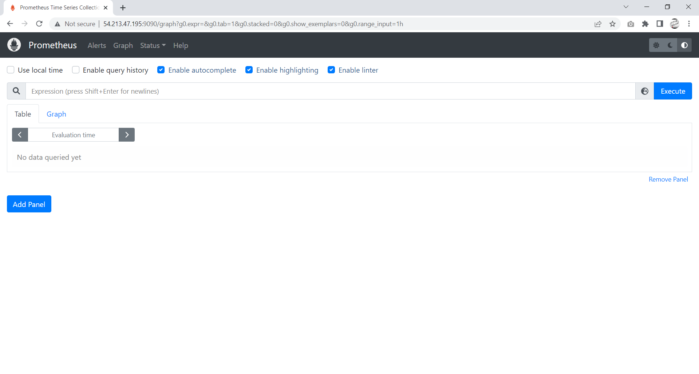
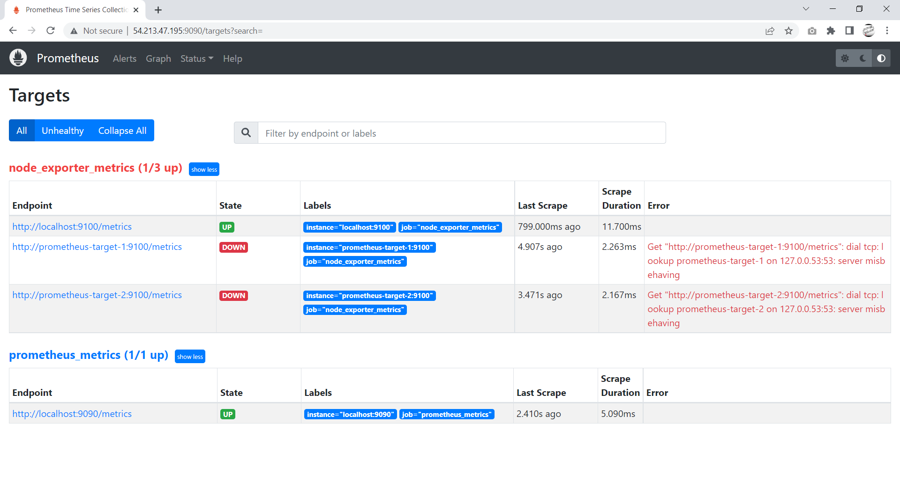

# 1. Node Exporter

**Node Eksporter** adalah perangkat lunak yang di gunakan tepat di samping aplikasi yang ingin diperoleh metriknya. dengan kata lain Node Eksporter berfungsi untuk mengambil suatu informasi yang nantinya akan diterima oleh sistem monitoring seperti `Prometheus`, mengumpulkan data yang diperlukan dari aplikasi, mengubahnya menjadi format yang lebih mudah, kemudian mengembalikannya sebagai respons terhadap sistem monitoring.

## Instalasi Node Exporter 

Sekarang kita akan melakukan instalasi **node exporter** untuk landasan monitoring server dengan prometheus dan grafana yang akan kita buat nantinya. Untuk melakukan instalasi kalian dapat mengikuti langkah-langkah di bawah ini :

- Masuk ke dalam server dan lakukan update dan upgrade.

  ```
  sudo apt update; sudo apt upgrade
  ```

- Selanjutnya kita lakukan instalasi terlebih dahulu **node exporter**nya.

  :::
  Lakukan instalasi pada ketiga buah server yang telah kalian buat.
  :::

  ```
  wget https://github.com/prometheus/node_exporter/releases/download/v1.3.1/node_exporter-1.3.1.linux-amd64.tar.gz
  ```


  


- Selanjutnya extract `node exporter` yang telah kalian lakukan instalasi.

  ```
  tar -xf node_exporter-1.3.1.linux-amd64.tar.gz
  ```


  


- Selanjutnya pindahkan isi dari `node exporter` yang telah kalian install ke dalam `/usr/local/bin`.

  ```
  sudo mv node_exporter-1.3.1.linux-amd64/node_exporter /usr/local/bin
  ```


  


- Sekarang kita tambahkan user untuk `node exporter` yang telah kita pindahkan sebelumnya.

  ```
  sudo useradd -rs /bin/false node_exporter
  ```


  


- Selanjutnya buat file konfigurasi pada `/etc/systemd/system/` dengan nama `node_exporter.service`, setelah itu masukkan konfigurasi berikut ini :

  

  

  ```
  sudo nano /etc/systemd/system/node_exporter.service
  ```

  ```
  [Unit]
  Description=Node Exporter
  After=network.target

  [Service]
  User=node_exporter
  Group=node_exporter
  Type=simple
  ExecStart=/usr/local/bin/node_exporter

  [Install]
  WantedBy=multi-user.target
  ```

  keterangan :
  [Unit] adalah nama dari si aplikasinya
  [Service] adalah informasi dari aplikasi
  [Install] adalah informasi untuk `node exporter` bisa di jalankan oleh user lain selain `node exporter`


- Karena kita tadi telah menambahkan konfigurasi untuk file service `node exporter`, sekarang kita akan melakukan reload untuk si servicenya. Untuk perintahnya kalian dapat menggunakan perintah dibawah ini :

  ```
  sudo systemctl daemon-reload
  ```

 
  
  

- Sekarang kita tinggal menghidupukan `node exporter` kita.

  ```
  sudo systemctl enable node_exporter
  ```

  
  
  

- Karena kita pertama kali membuat `node exporter` ini, sekarang kita akan menjalankan service dari si `node exporter`.

  ```
  sudo systemctl start node_exporter
  ```

  
  
  

- Jika tahapan diatas telah kalian jalankan sekarang kita coba cek apakah `node exporter` kita telah berjalan atau tidak.

  ```
  sudo systemctl status node_exporter
  ```


  
 

- Sekarang kita coba akses `node exporter` kita pada web.browser. Node exporter berjalan di atas port:9100

  http://(your server IP):9100


  


- Sekarang coba kalian klik pada bagian `metrics` selanjutnya kalian akan diarahkan ke menu seperti gambar dibawah ini, disini kalian dapat melihat sistem yang sedang berjalan maupun apa saja yang sedang dijalankan tetapi tampilannya kurang mengenakkan makannya disini kita perlu prometheus agar dapat membaca kinerja sistem kita secara mudah.

  
  


 
# 2. Prometheus

**Prometheus** adalah open source, sistem monitoring berbasis metrics. Prometheus mudah di gunakan serta memiliki model data yang powerful dan bahasa query yang dapat menganalisa aplikasi dan infrastruktur yang kita miliki.

## Prometheus Installation

Sekarang kita akan melakukan instalasi prometheus pada salah satu server yang telah kalian buat.

- Pertama-tama kita lakukan installasi prometheus terlebih dahulu.

  ```
  wget https://github.com/prometheus/prometheus/releases/download/v2.36.0/prometheus-2.36.0.linux-amd64.tar.gz
  ```


  


- Selanjutnya extract prometheus yang telah kalian install.

  ```
  tar -xf prometheus-2.36.0.linux-amd64.tar.gz
  ```

 
  


- Selanjutnya pindah kan isi dari directory `prometheus-2.36.0.linux-amd64` yaitu `prometheus` dan `promtool` ke dalam `/usr/local/bin`

  ```
  sudo mv prometheus-2.36.0.linux-amd64/prometheus prometheus-2.36.0.linux-amd64/promtool /usr/local/bin
  ```


  


- Setelah itu buat sebuah directory di dalam `/etc` dan `/var/lib` dengan nama prometheus.

  ```
  sudo mkdir /etc/prometheus /var/lib/prometheus
  ```

 
  


- Selanjutnya pindahkan lagi isi dari directory `prometheus-2.36.0.linux-amd64` yaitu `consoles` dan `console_libraries` ke dalam `/etc/prometheus`

  ```
  sudo mv prometheus-2.36.0.linux-amd64/consoles prometheus-2.36.0.linux-amd64/console_libraries /etc/prometheus
  ```

 
  


- Selanjutnya buat file konfigurasi pada `/etc/prometheus/` dengan nama `prometheus.yml`. Lalu masukkan konfigurasi berikut ini :

  ```
  sudo nano /etc/prometheus/prometheus.yml
  ```

  ```
    global:
     scrape_interval: 10s
    scrape_configs:
     - job_name: 'prometheus_metrics'
       scrape_interval: 5s
       static_configs:
       - targets: ['localhost:9090']
     - job_name: 'node_exporter_metrics'
       scrape_interval: 5s
       static_configs:
       - targets: ['localhost:9100','prometheus-target-1:9100','prometheus-target-2:9100']
  ```

  :::
  ubah pada bagian target, pastikan sesuai dengan IP dari server kalian
  :::


  
 

- Sekarang kita tambahkan user untuk `prometheus` yang telah kita pindahkan sebelumnya.

  ```
  sudo useradd -rs /bin/false prometheus
  ```


  
 

- Selanjutnya kita akan mengganti ownership untuk prometheus kita.

  ```
  sudo chown -R prometheus: /etc/prometheus /var/lib/prometheus
  ```

 
  
  

- Selanjut buat file konfigurasi pada `/etc/systemd/system/` dengan nama `prometheus.service`, setelah itu masukkan konfigurasi berikut ini :

  ```
  sudo nano /etc/systemd/system/prometheus.service
  ```

  ```
  [Unit]
  Description=Prometheus
  After=network.target

  [Service]
  User=prometheus
  Group=prometheus
  Type=simple
  ExecStart=/usr/local/bin/prometheus \
     --config.file /etc/prometheus/prometheus.yml \
     --storage.tsdb.path /var/lib/prometheus/ \
     --web.console.templates=/etc/prometheus/consoles \
     --web.console.libraries=/etc/prometheus/console_libraries

  [Install]
  WantedBy=multi-user.target
  ```

  
  

  **keterangan :**

  - [Unit] adalah nama dari si aplikasinya
  - [Service] adalah informasi dari aplikasi
  - [Install] adalah informasi untuk `prometheus` bisa di jalankan oleh user lain selain `prometheus`

- Karena kita tadi telah menambahkan konfigurasi untuk file service `Prometheus`, sekarang kita akan melakukan reload untuk si servicenya. Untuk perintahnya kalian dapat menggunakan perintah dibawah ini :

  ```
  sudo systemctl daemon-reload
  ```

  
  


- Sekarang kita tinggal menghidupukan `prometheus` kita.

  ```
  sudo systemctl enable prometheus
  ```

  
  


- Karena kita pertama kali membuat `prometheus` ini, sekarang kita akan menjalankan service dari `prometheus`.

  ```
  sudo systemctl start prometheus
  ```


  


- Jika tahapan diatas telah kalian jalankan sekarang kita coba cek apakah `prometheus` kita telah berjalan atau tidak.

  ```
  sudo systemctl status prometheus
  ```


  
  

- Sekarang kita coba akses `prometheus` kita pada web.browser. Prometheus berjalan di atas port:9090

  http://(your server IP):9090

  

- Disini target saya down semua karena memang saya tadi tidak memasukkan ip target server nya, karena ini hanya instance tes saja

  


